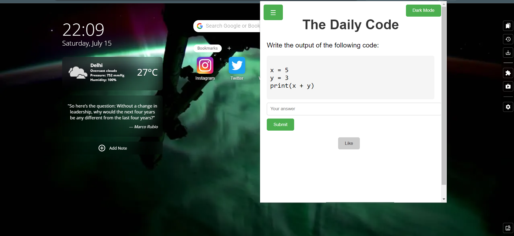
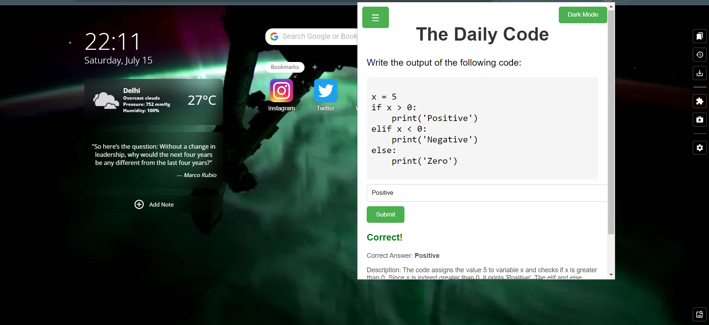
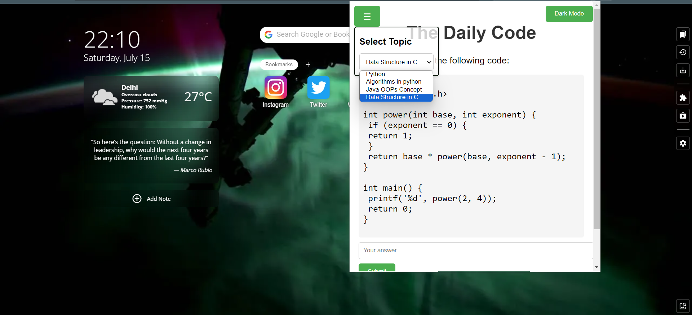
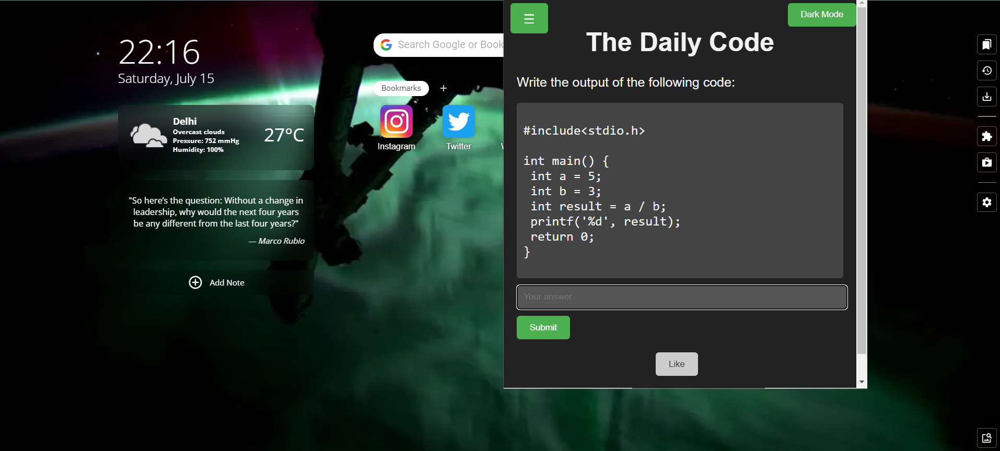

# The Daily Quest Extension



Welcome to "The Daily Quest" extension, a captivating browser extension that provides daily insights, interesting and joyful coding output questions, stimulating your curiosity and expanding your knowledge of programming.

## Installation

To download and install the extension, follow these simple steps:

1. Clone the repository using the following command in your terminal or Git Bash:

    ```shell
   git clone https://github.com/gauravkumarchaurasiya/The-Daily-Quest.git
    ```

3. Open your preferred browser and navigate to the extensions page.

  Example : 
  ```shell
   chrome://extensions
   ```

4. Enable the developer mode or open the developer options. This allows you to load unpacked extensions.

5. Click on "Load unpacked" or "Load extension" to load the extension.

6. Select the folder where you cloned the repository, named "The-Daily-Quest".

7. Voila! "The Daily Quest" extension is now installed and ready to provide you with daily doses of enlightenment.

## Usage

Once the extension is installed, the captivating journey begins. Simply click on "The Daily Quest" icon nestled in your browser's toolbar, and prepare to embark on an enthralling exploration.

Every time, the extension will present you with insightful prompts, thought-provoking questions, and fascinating tidbits of knowledge. Engage with these queries, ponder their depths, and let your curiosity guide you towards new insights and understanding coding concepts.



### Selecting Different Categories



"The Daily Quest" extension offers a range of categories to cater to your specific interests. To select a different category, follow these steps:

1. Click on the extension icon in the browser toolbar.

2. Navigate to the settings or preferences section.

3. Choose your preferred category from the available options, such as Science, History, Technology, or Philosophy.

4. Save the changes.

Now, "The Daily Quest" extension will tailor the insights and questions to the selected category, providing you with a more focused and personalized experience with dark mode.




We hope you enjoy "The Daily Quest" and find it to be an inspiring companion on your journey of exploration and discovery!
